<div align="center">


### My _geeked_ homelab k8s cluster 

_... automated via [Flux](https://github.com/fluxcd/flux2), [Renovate](https://github.com/renovatebot/renovate)  
w
</div>

<div align="center">

[](https://discord.gg/home-operations)&nbsp;&nbsp;
[](https://talos.dev)&nbsp;&nbsp;
[](https://kubernetes.io)&nbsp;&nbsp;
[](https://fluxcd.io)&nbsp;&nbsp;
[](https://github.com/rdartus/home-ops/actions/workflows/renovate.yaml)

</div>

<div align="center">

[](https://status.k13.dev)

</div>

<div align="center">

[](https://github.com/kashalls/kromgo)&nbsp;&nbsp;
[](https://github.com/kashalls/kromgo)&nbsp;&nbsp;
[](https://github.com/kashalls/kromgo)&nbsp;&nbsp;
[](https://github.com/kashalls/kromgo)&nbsp;&nbsp;
[](https://github.com/kashalls/kromgo)&nbsp;&nbsp;
[](https://github.com/kashalls/kromgo)&nbsp;&nbsp;
[](https://github.com/kashalls/kromgo)&nbsp;&nbsp;
[](https://github.com/kashalls/kromgo)

</div>

---

##  Overview

This is a repository for my home infrastructure and Kubernetes cluster. I try to adhere to Infrastructure as Code (IaC) and GitOps practices using tools like [Kubernetes](https://github.com/kubernetes/kubernetes), [Flux](https://github.com/fluxcd/flux2), [Renovate](https://github.com/renovatebot/renovate), and [GitHub Actions](https://github.com/features/actions).

---

##  Kubernetes

This hobo cluster operates on [Talos Linux](https://github.com/siderolabs/talos), an immutable and ephemeral Linux distribution tailored for [Kubernetes](https://github.com/kubernetes/kubernetes), and is deployed on bare-metal [RPI](https://store.minisforum.com/products/minisforum-ms-a2) & [NUC](https://store.minisforum.com/products/minisforum-ms-a2) workstations. [Longhorn](https://github.com/rook/rook) supplies my workloads with persistent block, object, and file storage, while a separate server handles media file storage. The cluster is designed to enable a full teardown without any data loss but some downtime.

There is a template at [onedr0p/cluster-template](https://github.com/onedr0p/cluster-template) if you want to follow along with some of the practices I use here.

### Core Components

- [cert-manager](https://github.com/cert-manager/cert-manager): Creates SSL certificates for services in my cluster.
- [longhron](https://longhorn.io/): Distributed block storage for peristent storage.
- [flannel](https://flannel) : internal networking for my workloads.
- [vault](https://vault): Creates SSL certificates for services in my cluster.
- [wireguard](https://wireguard): VPN for remote access & local ip address while roaming.
- [Postgres](https://wireguard): CNPG Operator for eazy PG Management.
- [MetalLB](https://wireguard): LB to expose only 1 IP to router.
- [Authentik](https://wireguard): IDM, SSO for securing the apps.
- [Hajimari](https://wireguard): Sleek but unmaintained home page.

### GitOps

[Flux](https://github.com/fluxcd/flux2) watches my [kubernetes](./kubernetes) folder (see Directories below) and makes the changes to my clusters based on the state of my Git repository.

The way Flux works for me here is it will recursively search the [kubernetes/apps](./kubernetes/apps) folder until it finds the most top level `kustomization.yaml` per directory and then apply all the resources listed in it. That aforementioned `kustomization.yaml` will generally only have a namespace resource and one or many Flux kustomizations (`ks.yaml`). Under the control of those Flux kustomizations there will be a `HelmRelease` or other resources related to the application which will be applied.

[Renovate](https://github.com/renovatebot/renovate) monitors my **entire** repository for dependency updates, automatically creating a PR when updates are found. When some PRs are merged Flux applies the changes to my cluster.

### Directories

This Git repository contains the following directories under [kubernetes](./kubernetes).

```sh
📁 kubernetes      # Kubernetes cluster defined as code
├─📁 _archive      # Apps undeployed - to be removed
├─📁 apps          # Apps deployed into my cluster grouped by namespace (see below)
├─📁 components    # Re-usable kustomize components
└─📁 flux          # Flux system configuration
```

### Cluster layout

```mermaid
graph TD;

  flux_controller["Flux Controller"]

  default__authentik["authentik"]
  default__autobrr["autobrr"]
  default__automate_wx["automate-wx"]
  default__books["books"]
  cert_manager__cert_manager["cert-manager"]
  cert_manager__cert_manager_issuers["cert-manager-issuers"]
  default__christmas["christmas"]
  flux_system__cluster_apps["cluster-apps"]
  flux_system__cluster_meta["cluster-meta"]
  database__cnpg["cnpg"]
  database__cnpg_resources["cnpg-resources"]
  default__coder["coder"]
  network__crowdsec["crowdsec"]
  kube_system__csi_driver_smb["csi-driver-smb"]
  kube_system__csi_driver_smb_ressources["csi-driver-smb-ressources"]
  network__ddns_updater["ddns-updater"]
  default__endlessh["endlessh"]
  default__filebrowser["filebrowser"]
  default__flaresolverr["flaresolverr"]
  flux_system__flux_instance["flux-instance"]
  flux_system__flux_operator["flux-operator"]
  default__ghostfolio["ghostfolio"]
  observability__grafana["grafana"]
  default__hajimari["hajimari"]
  default__immich["immich"]
  default__jellyfin["jellyfin"]
  default__kavita["kavita"]
  observability__kromgo["kromgo"]
  observability__kube_prometeus_stack["kube-prometeus-stack"]
  kube_system__kubernetes_replicator["kubernetes-replicator"]
  default__livres["livres"]
  longhorn_system__local_path_provisioner["local-path-provisioner"]
  longhorn_system__longhorn["longhorn"]
  longhorn_system__longhorn_resources["longhorn-resources"]
  longhorn_system__longhorn_restore["longhorn-restore"]
  default__mealie["mealie"]
  network__metallb["metallb"]
  network__metallb_resources["metallb-resources"]
  default__onlyoffice["onlyoffice"]
  default__paperless["paperless"]
  database__pg_dump["pg-dump"]
  database__pg_dump_sync["pg-dump-sync"]
  database__pg_restore["pg-restore"]
  database__pgadmin["pgadmin"]
  default__prowlarr["prowlarr"]
  default__rabbitmq["rabbitmq"]
  default__rabbitmq_resources["rabbitmq-resources"]
  default__radarr["radarr"]
  default__sonarr["sonarr"]
  default__tandoor["tandoor"]
  default__test_christmas["test-christmas"]
  network__traefik["traefik"]
  network__traefik_resources["traefik-resources"]
  default__valkey["valkey"]
  vault__vault["vault"]
  vault__vault_secrets_operator["vault-secrets-operator"]
  network__wireguard["wireguard"]

  flux_controller --> default__christmas
  flux_controller --> default__test_christmas
  flux_controller --> default__valkey
  flux_controller --> flux_system__cluster_meta
  flux_controller --> flux_system__flux_instance
  flux_controller --> flux_system__flux_operator
  flux_controller --> kube_system__kubernetes_replicator
  flux_controller --> longhorn_system__local_path_provisioner
  flux_controller --> network__metallb
  flux_controller --> network__traefik
  flux_controller --> vault__vault

  cert_manager__cert_manager --> cert_manager__cert_manager_issuers
  cert_manager__cert_manager_issuers --> database__cnpg
  database__cnpg --> database__cnpg_resources
  database__cnpg --> database__pg_dump
  database__cnpg --> database__pg_dump_sync
  database__cnpg_resources --> database__pg_restore
  database__cnpg_resources --> database__pgadmin
  database__cnpg_resources --> default__immich
  database__cnpg_resources --> default__onlyoffice
  default__authentik --> database__pgadmin
  default__authentik --> default__filebrowser
  default__automate_wx --> default__hajimari
  default__books --> default__endlessh
  default__endlessh --> default__ghostfolio
  default__endlessh --> default__paperless
  default__filebrowser --> default__immich
  default__flaresolverr --> default__sonarr
  default__immich --> default__flaresolverr
  default__immich --> default__kavita
  default__immich --> default__mealie
  default__immich --> default__tandoor
  default__jellyfin --> default__books
  default__jellyfin --> default__livres
  default__prowlarr --> default__jellyfin
  default__rabbitmq --> default__rabbitmq_resources
  default__radarr --> default__books
  default__radarr --> default__coder
  default__radarr --> default__livres
  default__sonarr --> default__autobrr
  default__sonarr --> default__prowlarr
  default__sonarr --> default__radarr
  default__valkey --> default__authentik
  flux_system__cluster_meta --> flux_system__cluster_apps
  kube_system__csi_driver_smb_ressources --> default__filebrowser
  kube_system__kubernetes_replicator --> database__cnpg_resources
  longhorn_system__longhorn --> longhorn_system__longhorn_resources
  longhorn_system__longhorn_resources --> longhorn_system__longhorn_restore
  longhorn_system__longhorn_resources --> observability__kube_prometeus_stack
  longhorn_system__longhorn_restore --> database__pg_dump
  longhorn_system__longhorn_restore --> database__pg_dump_sync
  longhorn_system__longhorn_restore --> default__immich
  network__crowdsec --> network__traefik_resources
  network__metallb --> network__metallb_resources
  network__metallb --> network__traefik_resources
  network__metallb_resources --> observability__grafana
  network__metallb_resources --> observability__kromgo
  network__traefik --> default__authentik
  network__traefik --> default__hajimari
  network__traefik --> kube_system__csi_driver_smb
  network__traefik --> kube_system__csi_driver_smb_ressources
  network__traefik --> network__ddns_updater
  network__traefik --> network__traefik_resources
  network__traefik_resources --> longhorn_system__longhorn
  observability__grafana --> cert_manager__cert_manager
  observability__kromgo --> cert_manager__cert_manager
  observability__kube_prometeus_stack --> observability__grafana
  observability__kube_prometeus_stack --> observability__kromgo
  vault__vault --> vault__vault_secrets_operator
  vault__vault_secrets_operator --> default__authentik
  vault__vault_secrets_operator --> default__automate_wx
  vault__vault_secrets_operator --> default__rabbitmq
  vault__vault_secrets_operator --> kube_system__csi_driver_smb
  vault__vault_secrets_operator --> kube_system__csi_driver_smb_ressources
  vault__vault_secrets_operator --> network__crowdsec
  vault__vault_secrets_operator --> network__ddns_updater
  vault__vault_secrets_operator --> network__wireguard

  classDef cls_flux_ctrl fill:#1a001a,stroke:#ff00ff,color:#ff00ff,stroke-width:3px,font-weight:bold;
  classDef cls_cert_manager fill:#0d0d0d,stroke:#00ff9f,color:#00ff9f,stroke-width:2px;
  classDef cls_database fill:#0d0d0d,stroke:#ff6b35,color:#ff6b35,stroke-width:2px;
  classDef cls_default fill:#0d0d0d,stroke:#00d4ff,color:#00d4ff,stroke-width:2px;
  classDef cls_flux_system fill:#0d0d0d,stroke:#39ff14,color:#39ff14,stroke-width:2px;
  classDef cls_kube_system fill:#0d0d0d,stroke:#d400ff,color:#d400ff,stroke-width:2px;
  classDef cls_longhorn_system fill:#0d0d0d,stroke:#ff003c,color:#ff003c,stroke-width:2px;
  classDef cls_network fill:#0d0d0d,stroke:#00ffe7,color:#00ffe7,stroke-width:2px;
  classDef cls_observability fill:#0d0d0d,stroke:#ff007f,color:#ff007f,stroke-width:2px;
  classDef cls_vault fill:#0d0d0d,stroke:#ffe600,color:#ffe600,stroke-width:2px;

  class flux_controller cls_flux_ctrl;
  class cert_manager__cert_manager,cert_manager__cert_manager_issuers cls_cert_manager;
  class database__cnpg,database__cnpg_resources,database__pg_dump,database__pg_dump_sync,database__pg_restore,database__pgadmin cls_database;
  class default__authentik,default__autobrr,default__automate_wx,default__books,default__christmas,default__coder,default__endlessh,default__filebrowser,default__flaresolverr,default__ghostfolio,default__hajimari,default__immich,default__jellyfin,default__kavita,default__livres,default__mealie,default__onlyoffice,default__paperless,default__prowlarr,default__rabbitmq,default__rabbitmq_resources,default__radarr,default__sonarr,default__tandoor,default__test_christmas,default__valkey cls_default;
  class flux_system__cluster_apps,flux_system__cluster_meta,flux_system__flux_instance,flux_system__flux_operator cls_flux_system;
  class kube_system__csi_driver_smb,kube_system__csi_driver_smb_ressources,kube_system__kubernetes_replicator cls_kube_system;
  class longhorn_system__local_path_provisioner,longhorn_system__longhorn,longhorn_system__longhorn_resources,longhorn_system__longhorn_restore cls_longhorn_system;
  class network__crowdsec,network__ddns_updater,network__metallb,network__metallb_resources,network__traefik,network__traefik_resources,network__wireguard cls_network;
  class observability__grafana,observability__kromgo,observability__kube_prometeus_stack cls_observability;
  class vault__vault,vault__vault_secrets_operator cls_vault;
```



### Networking

---

##  Hardware


| Device                        | Count | OS Disk Size   | Data Disk Size             | Ram   | Operating System | Purpose                 |
|-------------------------------|-------|---------------|-----------------------------|-------|------------------|-------------------------|
| Intel NUC (N150)              | 1     | 160GB M.2     | -                           | 16GB  | Talos            | Kubernetes              |
| Intel NUC (XXXXXU)            | 1     | 64GB (SD)     | -                           | 16B   | Talos            | Kubernetes              |
| Raspberry Pi 4                | 1     | 64GB (SD)     | -                           | 8GB   | Raspberry Pi OS  | NAS                     |
| Raspberry Pi ZeroW            | 1     | 16GB (SD)     | -                           | 0,5GB | Raspberry Pi OS  | DNS Server              |

---


##  Stargazers

<div align="center">

<a href="https://star-history.com/#rdartus/home-ops&Date">
  <picture>
    <source media="(prefers-color-scheme: dark)" srcset="https://api.star-history.com/svg?repos=rdartus/home-ops&type=Date&theme=dark" />
    <source media="(prefers-color-scheme: light)" srcset="https://api.star-history.com/svg?repos=rdartus/home-ops&type=Date" />
    
  </picture>
</a>

</div>

---

##  Gratitude and Thanks

Many thanks to all the fantastic people who donate their time to the [Home Operations](https://discord.gg/home-operations) Discord community. Be sure to check out [kubesearch.dev](https://kubesearch.dev) for ideas on how to deploy applications or get ideas on what you may deploy.

---

##  Changelog

See the latest [release](https://github.com/rdartus/home-ops/releases/latest) notes.

---

##  License

See [LICENSE](./LICENSE).

---
##  Usefull notes & cmd

Get logs
```zsh
kubectl logs svc/argocd-server -n argocd  > argo.log && kubectl logs svc/argocd-repo-server -n argocd  > argorepo.log && kubectl logs svc/webhook-service -n metallb > metallb.log && kubectl logs pod/speaker-stlm6 -n metallb > speaker.log
```

Delete :
```zsh
kubectl delete pod -l app.kubernetes.io/component=speaker -n metallb
```
