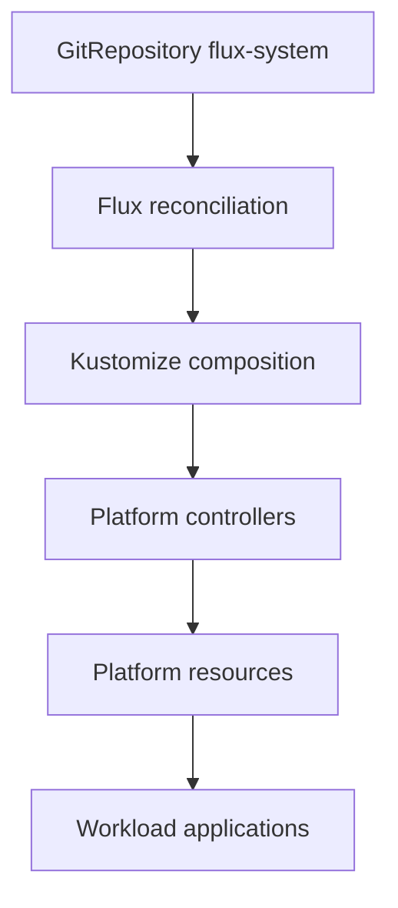
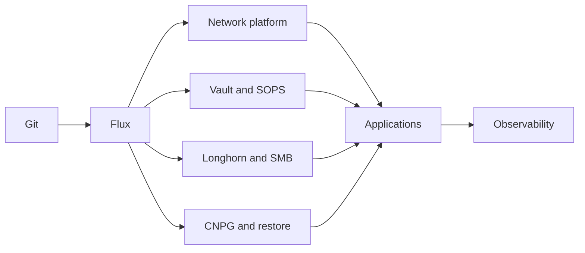

# Architecture Spine — home-ops

## Design Paradigm

Declarative GitOps reconciliation with layered Kubernetes composition:

- Git carries the desired state.
- Flux reconciles Kubernetes resources from Git.
- Kustomize composes local resources and components.
- HelmRelease and OCIRepository install packaged controllers and workloads.
- Platform namespaces establish capabilities consumed by workload namespaces.

## Invariants & Rules

### AD-1 — Git is the Kubernetes desired-state authority [ADOPTED]

- **Binds:** all Kubernetes platform and workload resources
- **Prevents:** imperative cluster changes becoming a second durable source of truth
- **Rule:** make persistent Kubernetes changes in `kubernetes/` and let Flux reconcile them; any emergency manual change must be reconciled back into Git or explicitly reverted.

### AD-2 — Platform capabilities precede workload consumption [ADOPTED]

- **Binds:** Flux, network, vault, cert-manager, longhorn-system, kube-system, database, observability, default and gpu namespaces
- **Prevents:** applications privately reimplementing shared ingress, certificates, secrets, storage, database or observability contracts
- **Rule:** consume shared capabilities through their platform resources and keep application-specific resources below the namespace/application Kustomization boundary.

### AD-3 — Flux dependencies express required readiness ordering [ADOPTED]

- **Binds:** every required inter-component dependency
- **Prevents:** reconciliation races hidden behind directory order or undocumented operational sequencing
- **Rule:** declare `spec.dependsOn` for required prerequisites and use `wait`, `timeout` and `healthCheckExprs` where readiness is part of the contract; treat `OPTIONAL` dependencies and parent-level `wait: false` as explicit degraded-mode choices.



### AD-4 — Secrets have separate repository and runtime ownership [ADOPTED]

- **Binds:** SOPS resources, Vault, Vault Secrets Operator and application secrets
- **Prevents:** plaintext credentials in Git and application-specific secret retrieval paths that bypass the platform contract
- **Rule:** protect repository/bootstrap secrets with SOPS/age; use VaultAuth and VaultStaticSecret for runtime application secrets; do not commit decrypted secret material.

### AD-5 — Storage intent is explicit [ADOPTED]

- **Binds:** PVCs, Longhorn, SMB StorageClasses and local-path-provisioner
- **Prevents:** data being placed on an incompatible or accidental storage backend
- **Rule:** select `longhorn`, an SMB-backed StorageClass or local-path according to the workload's data contract; do not rely on an undocumented default when placement or recovery matters.

### AD-6 — External traffic uses the platform ingress chain [ADOPTED]

- **Binds:** MetalLB, Traefik, cert-manager and application ingress resources
- **Prevents:** workloads creating incompatible load-balancer, routing or certificate paths
- **Rule:** expose services through the existing MetalLB/Traefik chain and use cert-manager issuers and the `traefik-ingresses` class or approved Traefik resources.

### AD-7 — Talos configuration is generated, validated and compared before apply [ADOPTED]

- **Binds:** `talos/talconfig.yaml`, `talos/talenv.yaml`, `talos/patches/` and generated node configuration
- **Prevents:** applying an unreviewed or stale machine configuration, or rotating cluster secrets accidentally
- **Rule:** regenerate with `talhelper genconfig`, validate generated configs, compare them with deployed machine configuration, then apply; do not run `talhelper gensecret` for the existing cluster except during an intentional full rebuild.

### AD-8 — Stateful data has one declared recovery owner [ASSUMPTION]

- **Binds:** Longhorn backups/restores, CNPG logical backups/restores, NAS-backed data and application PVCs
- **Prevents:** two recovery mechanisms restoring the same data with conflicting authority or retention
- **Rule:** each stateful data class must declare its authoritative backup source, restore procedure, retention, RPO/RTO and validation check before being considered operationally covered.

### AD-9 — Chart selection follows application complexity [ADOPTED]

- **Binds:** new and migrated HelmRelease-based applications
- **Prevents:** complex applications losing project-specific chart behavior and simple applications accumulating unnecessary chart-specific maintenance
- **Rule:** use the application's maintained chart when a complex application provides one; use `bjw-s-labs/app-template` for a simple application; document any exception in the application boundary.

### AD-10 — Dependency updates follow risk-based automation [ADOPTED]

- **Binds:** Renovate, Git hooks, CI, application dependencies, Talos, Kubernetes and observability charts
- **Prevents:** treating operating-system, control-plane or high-impact platform upgrades like ordinary application patches
- **Rule:** use Renovate for detection and PR creation; allow automated application patch merges only under `.renovate/packageRules.json`; keep Talos/Kubernetes upgrades manual and require their documented upgrade procedure; validate every integration through the Git hooks and CI chain.

## Consistency Conventions

| Concern | Convention |
| --- | --- |
| Resource composition | Use `ks.yaml` for Flux Kustomization boundaries and `app/kustomization.yaml` for local Kustomize composition. |
| Dependencies | Use explicit Flux `dependsOn`; do not encode prerequisites only in naming or README prose. |
| Secrets | Use SOPS for encrypted repository material and Vault resources for runtime application material. |
| Storage | Declare the intended `storageClassName` for persistent data with non-default placement or recovery requirements. |
| Chart selection | Use a maintained application chart for complex applications and `bjw-s-labs/app-template` for simple applications. |
| Dependency updates | Read `renovate.json` and `.renovate/packageRules.json`; do not infer auto-merge eligibility from version numbers alone. |
| Validation | Run `scripts/validate-kustomization-paths.sh --all` and `scripts/flux-preflight.sh` before integration. |
| Generated graph | Update the README graph through `scripts/flux-graph.py`; do not hand-edit its generated Mermaid block. |
| Stateful ownership | Assign one producer and rotation owner to shared secrets, and one recovery owner to each data class. |

## Stack

| Name | Version or state |
| --- | --- |
| Talos Linux | `v1.13.8` declared in `talos/talconfig.yaml` |
| Kubernetes | `v1.36.3` declared in `talos/talconfig.yaml` |
| Flux Operator | `0.58.1` OCI artifact |
| Flux distribution | `2.7.x` declared in Flux instance values |
| Longhorn | `1.12.1` Helm chart |
| Vault | `0.34.1` Helm chart |
| cert-manager | `v1.21.2` Helm chart |
| CloudNativePG | `0.29.0` Helm chart |
| Kustomize | Kubernetes-native declarative composition used by manifests and validation |
| Helm | Chart packaging consumed through Flux `HelmRelease` and OCI sources |
| Longhorn | Distributed block storage platform |
| Vault | Runtime secret management platform |
| SOPS/age | Repository secret encryption; SOPS metadata declares `3.10.2` |

## Structural Seed

```text
home-ops/
  kubernetes/
    apps/          # active platform services and workloads grouped by namespace
    components/    # reusable Kustomize components
    _archive/      # inactive manifests, excluded by default
  talos/           # cluster and node configuration inputs
  ansible/         # provisioning and operational procedures
  scripts/         # validation, graph generation and audits
  .githooks/       # local commit and push validation
  .github/         # CI validation
  docs/            # human and AI-oriented documentation
```



## Deferred

- The repository pins Flux distribution `2.7.x`, but the Kromgo `flux_version` endpoint returned `No Data` on 2026-10-02; do not present the repository pin as a live-cluster observation.
- This homelab has no formal RPO/RTO; it accepts downtime and prioritizes data preservation during a full teardown. Backup target, retention and restore validation remain optional operational details rather than service-level commitments.
- Dependencies marked `OPTIONAL` need operational confirmation before being promoted to mandatory architecture rules.
- Shared-secret producers and rotation owners need an explicit inventory before cross-namespace secret reuse is extended.
- Ingress/TLS profiles need normalization because current workloads use more than one resource style and issuer configuration.
- Existing complex applications currently using `app-template` need a per-application review before migration to a project chart.
- Namespace Pod Security Admission labels and live policies need verification; `privileged` namespaces should be narrowed where workloads permit it.
