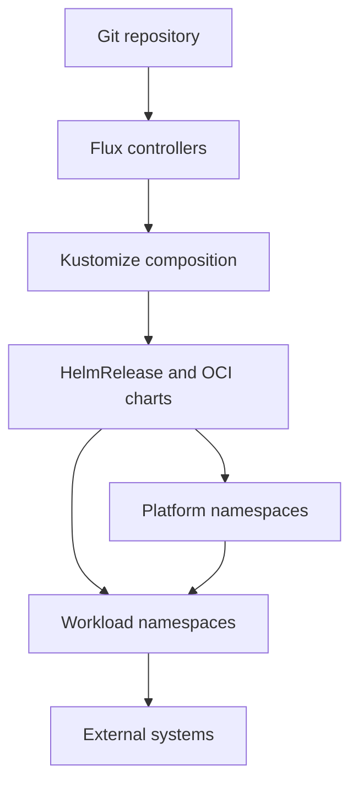
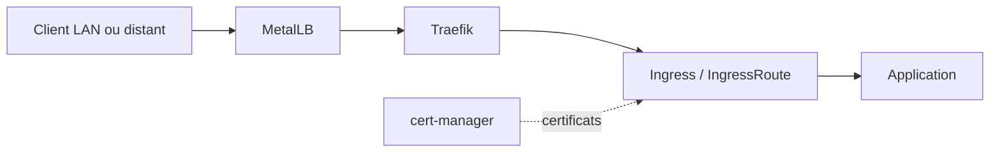

# Architecture technique

## Résumé

`home-ops` est un dépôt d'infrastructure as code et de GitOps pour un cluster Kubernetes bare metal exécuté sur Talos Linux. Le modèle d'architecture est une réconciliation déclarative : Git porte l'état désiré, Flux le réconcilie, Kustomize compose les ressources et les `HelmRelease` installent les charts et opérateurs.

Le cluster est organisé en deux niveaux : les services de plateforme fournissent les capacités communes, puis les applications consomment ces capacités au moyen de dépendances Flux explicites. Les données persistantes, les secrets, le réseau et les certificats sont traités comme des contrats de plateforme, pas comme des détails propres à chaque application.

## Vue des frontières

## Frontières du dépôt

| Zone | Rôle | Source principale |
| --- | --- | --- |
| `kubernetes/apps/flux-system` | Bootstrap et instances Flux | `kubernetes/apps/flux-system/` |
| `kubernetes/apps/network` | MetalLB, Traefik, Headscale, Tailscale, CrowdSec et exposition réseau | `kubernetes/apps/network/` |
| `kubernetes/apps/cert-manager` | Contrôleurs et émetteurs de certificats | `kubernetes/apps/cert-manager/` |
| `kubernetes/apps/vault` | Vault et intégration des secrets runtime | `kubernetes/apps/vault/` |
| `kubernetes/apps/longhorn-system` | Stockage bloc et restauration Longhorn | `kubernetes/apps/longhorn-system/` |
| `kubernetes/apps/kube-system` | CSI SMB, réplication de secrets et composants système | `kubernetes/apps/kube-system/` |
| `kubernetes/apps/database` | CloudNativePG, dump, restore, loader et pgAdmin | `kubernetes/apps/database/` |
| `kubernetes/apps/observability` | Prometheus/Grafana/Kromgo | `kubernetes/apps/observability/` |
| `kubernetes/apps/default` | Applications utilisateur et services partagés | `kubernetes/apps/default/` |
| `kubernetes/apps/gpu` | Workloads nécessitant la capacité GPU | `kubernetes/apps/gpu/` |
| `kubernetes/components` | Composants Kustomize réutilisables | `kubernetes/components/` |
| `talos` | OS, versions Kubernetes, nœuds et patches Talos | `talos/` |
| `ansible` | Provisioning historique, WSL et installation de nœuds | `ansible/` |
| `scripts` | Contrôles, graphe Flux et audits opérationnels | `scripts/` |

## Flux et composition

Chaque application active expose généralement un `ks.yaml`, qui définit une ressource Flux `Kustomization`. Cette ressource pointe vers un répertoire `app` ou `resources`, référence le `GitRepository` `flux-system`, et peut déclarer `dependsOn`, `wait`, `timeout` et des contrôles de santé.

Le répertoire ciblé contient ensuite une Kustomization Kustomize et un ou plusieurs objets Kubernetes. Les Helm charts sont installés par `HelmRelease`; les valeurs sont souvent injectées par `configMapGenerator` depuis `helm-values.yaml`. Les charts Flux utilisent aussi des `OCIRepository`.

### Politique de sélection des charts

Le chart fait partie de l'architecture de déploiement :

- une application complexe qui dispose d'un chart applicatif maintenu par son projet doit utiliser ce chart dédié ;
- une application simple doit utiliser le chart commun `bjw-s-labs/app-template` ;
- une exception doit être justifiée lorsqu'une application complexe reste sur `app-template` ou lorsqu'un chart dédié est remplacé par des manifests locaux.

Le dépôt montre déjà ces deux modèles. Authentik utilise son chart dédié, tandis qu'Immich et Hajimari utilisent `app-template` v5.1.0 depuis le dépôt `bjw-s`. Cette règle concerne les nouveaux déploiements et les migrations ; elle ne force pas une migration immédiate des workloads existants.

## Gouvernance des dépendances

Renovate est le mécanisme de détection et de proposition des mises à jour. Il surveille les sources Flux, manifests Kubernetes, valeurs Helm, Dockerfiles et les versions Talos/Kubernetes détectées par regex. La politique distingue les mises à jour applicatives à faible risque des mises à jour qui peuvent modifier le système d'exploitation, le control plane ou l'observabilité.

Les hooks locaux et la CI forment la chaîne de garde : le pre-commit vérifie les références Kustomize et régénère le graphe de dépendances, le pre-push exécute un dry-run Flux, puis GitHub Actions rejoue les validations pour les changements concernés. Une PR Renovate n'est donc intégrable qu'après passage de cette chaîne.

Les procédures d'upgrade Talos et Kubernetes sont attachées aux PR Renovate par `.renovate/packageRules.json`. Elles doivent rester synchronisées avec les procédures d'exploitation et ne doivent pas être remplacées par un simple bump de version.

Le graphe des dépendances est généré par `scripts/flux-graph.py`. Il exclut `kubernetes/_archive/` par défaut et représente les dépendances `spec.dependsOn` déclarées dans les `ks.yaml`. Le bootstrap actif `kubernetes/flux/cluster/ks.yaml` crée `cluster-meta`, puis `cluster-apps`, qui pointe vers `kubernetes/apps/`.

## Contrat de dépendances

Les dépendances suivantes sont observées dans les manifests :

- `vault-secrets-operator` dépend de `vault`.
- `cert-manager` et ses issuers dépendent notamment de Vault et Traefik.
- `cnpg` dépend de Longhorn et des issuers cert-manager.
- `cnpg-resources` dépend de l'opérateur CNPG, du replicator et des issuers.
- `longhorn-resources` dépend de Longhorn, puis `longhorn-restore` dépend des ressources Longhorn.
- `traefik-resources` dépend de Traefik, CrowdSec et MetalLB.

Les dépendances annotées `OPTIONAL` doivent être distinguées des prérequis réellement nécessaires. Leur statut opérationnel doit être confirmé avant de simplifier le graphe. `wait: false` sur un parent Flux ne signifie pas que tous les composants enfants sont prêts ; la readiness doit être lue au niveau du `ks.yaml` concerné.

## Secrets et identité

Deux circuits existent :

1. Les secrets de bootstrap et les valeurs sensibles du dépôt sont chiffrés avec SOPS/age. Flux utilise le provider SOPS et la ressource `sops-age` pour déchiffrer les ressources prévues.
2. Les secrets runtime sont récupérés depuis Vault avec `VaultAuth` et matérialisés par `VaultStaticSecret`. Les ressources d'application consomment ensuite les `Secret` Kubernetes générés.

Les ressources `SecretStore` peuvent fournir une intégration distincte avec un fournisseur externe. Il ne faut pas confondre ce chemin avec le circuit principal Vault.

La propriété de rotation des secrets partagés et des secrets répliqués entre namespaces n'est pas uniformément explicitée. Chaque nouveau secret partagé doit désigner un producteur, une source de rotation et les consommateurs concernés.

## Réseau et exposition

Le chemin d'exposition observé est :

MetalLB fournit des adresses LAN aux services concernés. Traefik porte les routes HTTP/TCP/UDP et les applications utilisent la classe `traefik-ingresses` ou des ressources Traefik. cert-manager fournit les certificats et les issuers sont dans `kubernetes/apps/cert-manager/cert-manager/issuers/`.

Headscale, Headplane, Tailscale et WireGuard couvrent l'accès distant ou privé. CrowdSec est branché sur les ressources Traefik pour la protection des services exposés.

## Stockage et données

- Longhorn fournit le stockage bloc distribué par défaut pour de nombreux PVC.
- Le CSI SMB fournit des StorageClasses NAS comme `all`, `conf`, `jeanstock`, `jeanstock-loisir` et `jeantasse-loisir`.
- `local-path-provisioner` est un chemin de stockage séparé dans `longhorn-system`.
- CNPG héberge les bases PostgreSQL dans le namespace `database`.
- Les applications choisissent leur stockage par `storageClassName` lorsqu'un emplacement de données est important.
- Les composants `pg-dump`, `pg-dump-sync`, `pg-restore` et `longhorn-restore` forment le circuit de sauvegarde/restauration déclaré.
- Longhorn déclare aussi des ressources de backup et de restore ; le propriétaire de référence d'une restauration doit être choisi par classe de données.

Ce homelab ne définit pas de RPO/RTO formels. Le README exprime une priorité de conservation des données lors d'un teardown complet, avec une tolérance explicite à l'indisponibilité ; la rétention, la cible exacte et les tests de restauration restent des détails opérationnels à documenter seulement s'ils deviennent nécessaires.

## Sécurité des namespaces

La posture de sécurité doit être évaluée à deux niveaux : labels Pod Security Admission sur les namespaces et `securityContext` généré par les charts. Le dépôt déclare explicitement `enforce=privileged` pour `gpu`, `longhorn-system`, `network` et `observability`. Les namespaces sans label local ne sont pas automatiquement sécurisés ou restreints : leur état effectif doit être vérifié sur le cluster.

Les composants système, réseau, stockage et GPU peuvent nécessiter des privilèges spécifiques. Une namespace privilégiée ne doit pas être considérée comme une justification suffisante pour tous ses workloads ; les exceptions doivent être limitées aux pods qui en ont besoin.

## Talos et infrastructure

Le cluster `klusterfox` déclare Talos `v1.13.8` et Kubernetes `v1.36.3`. Le control plane `nucoumouk` utilise `192.168.1.21` et la VIP `192.168.1.5`; le worker `nucsamere` utilise `192.168.1.20`. Les entrées effectives sont dans `talos/talconfig.yaml`, avec des patches globaux, control plane et par nœud.

`talhelper genconfig` produit des configurations dérivées. Les commandes d'application et de reconstruction sont documentées dans `ansible/README.md`. La génération de nouveaux secrets Talos est explicitement réservée à une reconstruction complète déclarée.

## Versions déclarées

| Composant | Version ou état | Source |
| --- | --- | --- |
| Talos | `v1.13.8` | `talos/talconfig.yaml` |
| Kubernetes | `v1.36.3` | `talos/talconfig.yaml` |
| Talos observé | `1.13.8` | endpoint Kromgo `talos_version`, vérifié le 2026-10-02 |
| Kubernetes observé | `1.36.3` | endpoint Kromgo `kubernetes_version`, vérifié le 2026-10-02 |
| Flux observé | `No Data` | endpoint Kromgo `flux_version`, vérifié le 2026-10-02 |
| SOPS | `3.10.2` dans les métadonnées chiffrées | `talos/*.sops.yaml` |
| Flux Operator | `0.58.1` | `kubernetes/apps/flux-system/flux-operator/{app,instance}/ocirepository.yaml` |
| Flux distribution | `2.7.x` | `kubernetes/apps/flux-system/flux-operator/instance/values.yaml` |
| Longhorn chart | `1.12.1` | `kubernetes/apps/longhorn-system/longhorn/app/helmrelease.yaml` |
| Vault chart | `0.34.1` | `kubernetes/apps/vault/vault/app/helmrelease.yaml` |
| cert-manager chart | `v1.21.2` | `kubernetes/apps/cert-manager/cert-manager/app/helmrelease.yaml` |
| CloudNativePG chart | `0.29.0` | `kubernetes/apps/database/cnpg/app/helmrelease.yaml` |
| Helm charts | versions gérées par les sources Flux/OCI et Renovate | `kubernetes/**`, `renovate.json` |

## Incohérences et limites connues

- Le README et `flux-graph.md` sont des sorties générées et doivent être régénérés après modification des `ks.yaml`; ils peuvent contenir des nœuds d'applications archivées ou historiques selon la commande utilisée.
- Le contrat de sauvegarde et de restauration est structurellement présent, mais ses garanties métier ne sont pas spécifiées.
- Les profils ingress/TLS ne sont pas totalement uniformes entre les applications ; la classe Traefik et les issuers cert-manager doivent être normalisés avant d'être traités comme un profil unique.