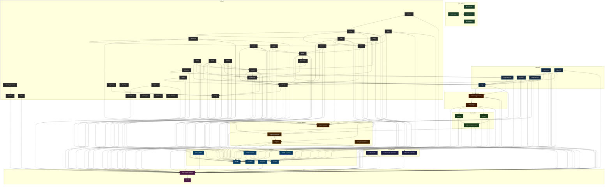

```mermaid
%%{init: {"flowchart": {"curve": "basis"}} }%%
flowchart TD

  subgraph flux_sg["Flux System"]
    flux_system__flux_operator["flux-operator"]
    flux_system__flux_instance["flux-instance"]
    flux_system__cluster_meta["cluster-meta"]
    flux_system__cluster_apps["cluster-apps"]
  end

  subgraph vault_sg["Vault"]
    vault__vault["vault"]
    vault__vault_secrets_operator["vault-secrets-operator"]
  end

  subgraph network_sg["Network"]
    network__crowdsec["crowdsec"]
    network__metallb["metallb"]
    network__metallb_resources["metallb-resources"]
    network__traefik["traefik"]
    network__traefik_resources["traefik-resources"]
    network__ddns_updater["ddns-updater"]
    network__wireguard["wireguard"]
  end

  subgraph observability_sg["Observability"]
    observability__kube_prometeus_stack["kube-prometeus-stack"]
    observability__grafana["grafana"]
    observability__kromgo["kromgo"]
  end

  subgraph longhorn_sg["Longhorn System"]
    longhorn_system__longhorn["longhorn"]
    longhorn_system__longhorn_resources["longhorn-resources"]
    longhorn_system__longhorn_restore["longhorn-restore"]
    longhorn_system__local_path_provisioner["local-path-provisioner"]
  end

  subgraph kube_sg["Kube System"]
    kube_system__csi_driver_smb["csi-driver-smb"]
    kube_system__csi_driver_smb_ressources["csi-driver-smb-ressources"]
    kube_system__kubernetes_replicator["kubernetes-replicator"]
  end

  subgraph cert_sg["Cert Manager"]
    cert_manager__cert_manager["cert-manager"]
    cert_manager__cert_manager_issuers["cert-manager-issuers"]
  end

  subgraph database_sg["Database"]
    database__cnpg["cnpg"]
    database__cnpg_resources["cnpg-resources"]
    database__pg_dump["pg-dump"]
    database__pg_dump_sync["pg-dump-sync"]
    database__pg_restore["pg-restore"]
    database__pgadmin["pgadmin"]
  end

  subgraph default_sg["Default"]
    default__valkey["valkey"]
    default__redis["redis"]
    default__rabbitmq["rabbitmq"]
    default__rabbitmq_resources["rabbitmq-resources"]
    default__authentik["authentik"]
    default__filebrowser["filebrowser"]
    default__flaresolverr["flaresolverr"]
    default__immich["immich"]
    default__prowlarr["prowlarr"]
    default__sonarr["sonarr"]
    default__radarr["radarr"]
    default__autobrr["autobrr"]
    default__qbittorrent["qbittorrent"]
    default__jellyfin["jellyfin"]
    default__kavita["kavita"]
    default__books["books"]
    default__livres["livres"]
    default__mealie["mealie"]
    default__tandoor["tandoor"]
    default__onlyoffice["onlyoffice"]
    default__paperless["paperless"]
    default__ghostfolio["ghostfolio"]
    default__hajimari["hajimari"]
    default__automate_wx["automate-wx"]
    default__coder["coder"]
    default__endlessh["endlessh"]
    default__kubotheque["kubotheque"]
    default__christmas["christmas"]
    default__test_christmas["test-christmas"]
    default__ygege["ygege"]
    default__zitadel["zitadel"]
  end

  %% --- Flux ---
  flux_system__cluster_apps --> flux_system__cluster_meta

  %% --- Vault ---
  vault__vault_secrets_operator --> vault__vault

  %% --- Network (internal) ---
  network__metallb_resources --> network__metallb
  network__traefik_resources --> network__crowdsec
  network__traefik_resources --> network__metallb
  network__traefik_resources --> network__traefik
  network__ddns_updater --> network__traefik
  network__ddns_updater --> vault__vault_secrets_operator

  %% --- Network (cross) ---
  network__crowdsec --> vault__vault_secrets_operator
  network__wireguard --> vault__vault_secrets_operator
  kube_system__csi_driver_smb --> network__traefik
  kube_system__csi_driver_smb --> vault__vault_secrets_operator
  kube_system__csi_driver_smb_ressources --> network__traefik
  kube_system__csi_driver_smb_ressources --> vault__vault_secrets_operator

  %% --- Observability ---
  observability__kube_prometeus_stack --> longhorn_system__longhorn_resources
  observability__kube_prometeus_stack --> network__traefik_resources
  observability__kube_prometeus_stack --> vault__vault_secrets_operator
  observability__grafana --> network__metallb_resources
  observability__grafana --> network__traefik
  observability__grafana --> observability__kube_prometeus_stack
  observability__grafana --> vault__vault_secrets_operator
  observability__kromgo --> network__metallb_resources
  observability__kromgo --> network__traefik
  observability__kromgo --> observability__kube_prometeus_stack
  observability__kromgo --> vault__vault_secrets_operator

  %% --- Longhorn ---
  longhorn_system__longhorn --> network__metallb
  longhorn_system__longhorn --> network__traefik_resources
  longhorn_system__longhorn --> vault__vault_secrets_operator
  longhorn_system__longhorn_resources --> longhorn_system__longhorn
  longhorn_system__longhorn_restore --> longhorn_system__longhorn_resources

  %% --- Cert Manager ---
  cert_manager__cert_manager --> network__traefik
  cert_manager__cert_manager --> observability__grafana
  cert_manager__cert_manager --> observability__kromgo
  cert_manager__cert_manager --> vault__vault_secrets_operator
  cert_manager__cert_manager_issuers --> cert_manager__cert_manager
  cert_manager__cert_manager_issuers --> network__traefik
  cert_manager__cert_manager_issuers --> vault__vault_secrets_operator

  %% --- Database ---
  database__cnpg --> cert_manager__cert_manager_issuers
  database__cnpg --> longhorn_system__longhorn
  database__cnpg_resources --> cert_manager__cert_manager_issuers
  database__cnpg_resources --> database__cnpg
  database__cnpg_resources --> kube_system__kubernetes_replicator
  database__pg_dump --> database__cnpg
  database__pg_dump --> longhorn_system__longhorn_restore
  database__pg_dump --> network__traefik
  database__pg_dump --> vault__vault_secrets_operator
  database__pg_dump_sync --> database__cnpg
  database__pg_dump_sync --> longhorn_system__longhorn_restore
  database__pg_dump_sync --> network__traefik
  database__pg_dump_sync --> vault__vault_secrets_operator
  database__pg_restore --> database__cnpg
  database__pg_restore --> database__cnpg_resources
  database__pg_restore --> kube_system__kubernetes_replicator
  database__pg_restore --> network__traefik
  database__pg_restore --> vault__vault_secrets_operator
  database__pgadmin --> database__cnpg_resources
  database__pgadmin --> default__authentik
  database__pgadmin --> network__traefik
  database__pgadmin --> vault__vault_secrets_operator

  %% --- Default: base services ---
  default__rabbitmq --> vault__vault_secrets_operator
  default__rabbitmq_resources --> default__rabbitmq
  default__redis --> vault__vault_secrets_operator
  default__valkey --> vault__vault_secrets_operator
  default__authentik --> default__valkey
  default__authentik --> network__traefik
  default__authentik --> vault__vault_secrets_operator
  default__automate_wx --> vault__vault_secrets_operator

  %% --- Default: file & media ---
  default__filebrowser --> default__authentik
  default__filebrowser --> kube_system__csi_driver_smb_ressources
  default__filebrowser --> vault__vault_secrets_operator
  default__immich --> database__cnpg_resources
  default__immich --> default__authentik
  default__immich --> default__filebrowser
  default__immich --> default__valkey
  default__immich --> longhorn_system__longhorn_restore
  default__immich --> vault__vault_secrets_operator
  default__flaresolverr --> default__filebrowser
  default__flaresolverr --> default__immich

  %% --- Default: *arr stack ---
  default__sonarr --> database__cnpg
  default__sonarr --> default__authentik
  default__sonarr --> default__flaresolverr
  default__sonarr --> network__traefik
  default__sonarr --> vault__vault_secrets_operator
  default__prowlarr --> default__authentik
  default__prowlarr --> default__sonarr
  default__prowlarr --> network__traefik
  default__prowlarr --> vault__vault_secrets_operator
  default__radarr --> default__authentik
  default__radarr --> default__sonarr
  default__radarr --> network__traefik
  default__radarr --> vault__vault_secrets_operator
  default__autobrr --> default__authentik
  default__autobrr --> default__sonarr
  default__autobrr --> network__traefik
  default__autobrr --> vault__vault_secrets_operator
  default__qbittorrent --> default__prowlarr
  default__qbittorrent --> longhorn_system__longhorn_resources
  default__qbittorrent --> network__traefik
  default__qbittorrent --> vault__vault_secrets_operator

  %% --- Default: media/library apps ---
  default__jellyfin --> default__filebrowser
  default__jellyfin --> default__immich
  default__jellyfin --> default__prowlarr
  default__jellyfin --> network__traefik
  default__jellyfin --> vault__vault_secrets_operator
  default__kavita --> database__cnpg
  default__kavita --> default__filebrowser
  default__kavita --> default__immich
  default__kavita --> longhorn_system__longhorn_restore
  default__kavita --> network__traefik
  default__kavita --> vault__vault_secrets_operator
  default__books --> default__jellyfin
  default__books --> default__radarr
  default__books --> longhorn_system__longhorn_restore
  default__books --> network__traefik
  default__books --> vault__vault_secrets_operator
  default__livres --> default__jellyfin
  default__livres --> default__radarr
  default__livres --> longhorn_system__longhorn_restore
  default__livres --> network__traefik
  default__livres --> vault__vault_secrets_operator

  %% --- Default: food & productivity ---
  default__mealie --> database__cnpg
  default__mealie --> default__filebrowser
  default__mealie --> default__immich
  default__mealie --> longhorn_system__longhorn_restore
  default__mealie --> network__traefik
  default__mealie --> vault__vault_secrets_operator
  default__tandoor --> database__cnpg
  default__tandoor --> default__filebrowser
  default__tandoor --> default__immich
  default__tandoor --> longhorn_system__longhorn_restore
  default__tandoor --> network__traefik
  default__tandoor --> vault__vault_secrets_operator
  default__onlyoffice --> database__cnpg_resources
  default__onlyoffice --> vault__vault_secrets_operator
  default__paperless --> default__valkey
  default__ghostfolio --> default__valkey

  %% --- Default: misc ---
  default__endlessh --> default__books
  default__endlessh --> network__traefik
  default__hajimari --> default__automate_wx
  default__hajimari --> network__traefik
  default__coder --> default__authentik
  default__coder --> default__radarr
  default__coder --> longhorn_system__longhorn_restore
  default__coder --> network__traefik
  default__coder --> vault__vault_secrets_operator
  default__ygege --> default__authentik
  default__ygege --> default__sonarr
  default__ygege --> network__traefik
  default__ygege --> vault__vault_secrets_operator
  default__zitadel --> default__authentik
  default__zitadel --> network__traefik
  default__zitadel --> vault__vault_secrets_operator

  %% --- Styling ---
  classDef vaultClass    fill:#4a1942,color:#fff,stroke:#9c27b0
  classDef networkClass  fill:#0d3b5e,color:#fff,stroke:#2196f3
  classDef obsClass      fill:#1a3a1a,color:#fff,stroke:#4caf50
  classDef longhornClass fill:#3e2000,color:#fff,stroke:#ff9800
  classDef kubeClass     fill:#1a1a3e,color:#fff,stroke:#9fa8da
  classDef certClass     fill:#3e1a00,color:#fff,stroke:#ff5722
  classDef dbClass       fill:#1a2a3e,color:#fff,stroke:#03a9f4
  classDef fluxClass     fill:#1a3e2a,color:#fff,stroke:#8bc34a
  classDef defaultClass  fill:#2a2a2a,color:#fff,stroke:#9e9e9e

  class vault__vault,vault__vault_secrets_operator vaultClass
  class network__crowdsec,network__metallb,network__metallb_resources,network__traefik,network__traefik_resources,network__ddns_updater,network__wireguard networkClass
  class observability__kube_prometeus_stack,observability__grafana,observability__kromgo obsClass
  class longhorn_system__longhorn,longhorn_system__longhorn_resources,longhorn_system__longhorn_restore,longhorn_system__local_path_provisioner longhornClass
  class kube_system__csi_driver_smb,kube_system__csi_driver_smb_ressources,kube_system__kubernetes_replicator kubeClass
  class cert_manager__cert_manager,cert_manager__cert_manager_issuers certClass
  class database__cnpg,database__cnpg_resources,database__pg_dump,database__pg_dump_sync,database__pg_restore,database__pgadmin dbClass
  class flux_system__flux_operator,flux_system__flux_instance,flux_system__cluster_meta,flux_system__cluster_apps fluxClass
  class default__valkey,default__redis,default__rabbitmq,default__rabbitmq_resources,default__authentik,default__filebrowser,default__flaresolverr,default__immich,default__prowlarr,default__sonarr,default__radarr,default__autobrr,default__qbittorrent,default__jellyfin,default__kavita,default__books,default__livres,default__mealie,default__tandoor,default__onlyoffice,default__paperless,default__ghostfolio,default__hajimari,default__automate_wx,default__coder,default__endlessh,default__kubotheque,default__christmas,default__test_christmas,default__ygege,default__zitadel defaultClass
```
